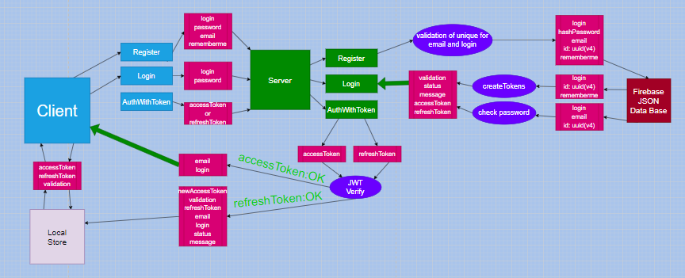

# Authorization on React using JWT

<p> This project was developed as a test task for the <b> Incorporate Now </b>. With the ability to authorize and check the validity of tokens (refresh and access), saving data from the client in the database. </p>
<p> Despite the fact that Firebase has methods such as <b> signInWithCustomToken() </b>, the project was implemented through the jwt library and authorization was done on nodeJS </p>

## Data Mutation Schema



<p>
The project has schemaTransferData.drawio which can be opened with plugins that support this extension or go to the site:
<a href="https://app.diagrams.net/"><b>https://app.diagrams.net/</b></a></p>

## Note

- On the server, the secret data is in an open file, for easier access (in the real moment in .env)
- The snapshotDB.js database was left on the server for easier understanding.

## Router

<p><b>/auth</b> - the start page on which registration or login takes place.<br/>
Redirect to /afterauth if localStorage contains data with accessToken</p>
<p><b>/afterauth</b> - page for confirming tokens and entering the closed page /index</p>
<p><b>/index</b> - closed page for unauthorized users with username information.<br/>
Redirect to /afterauth if tokens are invalid </p>
<p><b>*</b>- erroneous pages reserved Page 404 </p>

## Technology used

### Server

- NodeJS
- Firebase-Admin SDK
- JWT
- BcryptJs
- Express
- GraphQL
- uuid
- nodemon

### Client

- create-react-app typescript
- GraphQL + Apollo Client
- react-router-dom
- SASS
- Formik + Yup

## Unfinished tasks

- Implementing transfer of refreshToken via <b> cookie </b>;

## Project installation instructions

<br/>
<p>
    1. First you need to clone all files and folders to your device.
</p>
<p>
    2. Check if <b> nodeJS </b> and <b> npm </b> are installed in the cmd terminal or another available in your editor.
</p>

```
node -v
npm --v
```

<p> If an error occurs at this stage, you can install nodeJS from the official site <a href="https://nodejs.org/en/"> <b> NodeJS </b> </a> </p>

<p>
3. The next step is to install all project dependencies.
</p>

```
cd server
npm install

// after installation

cd ../client
npm install
```

<p>4. After some time has passed and the installation is complete, you need to start the server.</p>

```
npm run dev
```

The result should be like this:

```
Starting server in port: 4000
```

<p>
Now the server will be available from the GraphQL UI at the link <b>http://localhost:4000/graphql</b>
</p>

<p> 5. After starting the server, while in the Client folder, start the project on React, after which it will be available at <br/><b>http: //localhost:3000/</b></p>

```
npm start
```

<p><b>
If at any stage you have problems or questions, you can contact me in the github profile contacts
</b></p>
